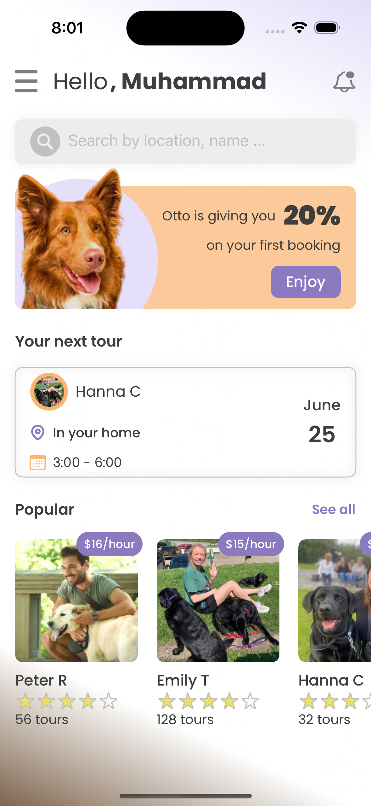
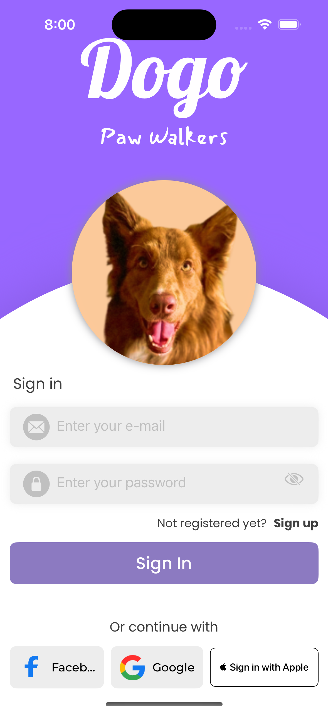

# Dogo-SwiftUI-App

## Description

Dogo is an iOS app designed for dog owners to manage and track their pets' activities and health. Built with SwiftUI, it offers a user-friendly interface and essential features to simplify pet care.

## Tech Stack

- **Swift**
- **SwiftUI**
- **Firebase**
- **Xcode**

## Architecture

Dogo follows the MVVM (Model-View-ViewModel) architecture, ensuring clear separation of concerns, better testability, and scalability.

## Screenshots

| Screenshot 1 | Screenshot 2 |
|--------------|--------------|
|  |  |
